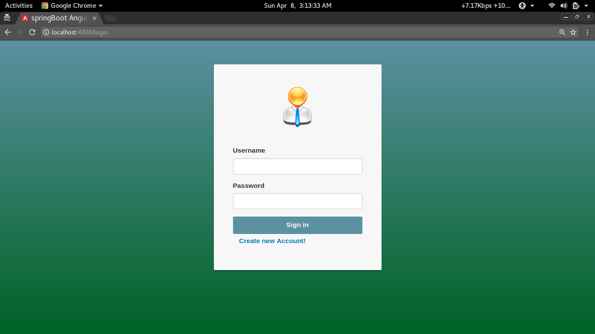
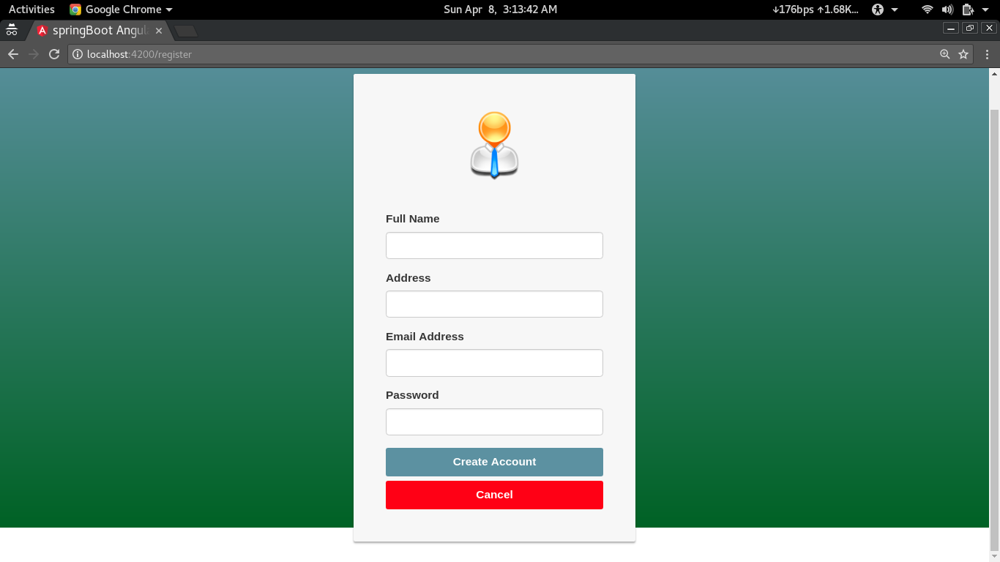

# Angular4 authentication   

#### AUTHOR:

- [Chandramohan Jagtap](https://github.com/cmjagtap "Chandramohan's github profile")

#### DESCRIPTION:
	This is a mini project Login and Authentication for user using Angular4

- this is the front-end layer of the app using anuglar 4 , 
- This project was generated with [Angular CLI](https://github.com/angular/angular-cli) version 1.5.0.

## Idea of the app 
 - simple user registration /  authentication 

## Development server

### installing the node module :
Use the following command in the project folder `npm install`

### running the server
Run `ng serve` for execution on server. Navigate to `http://localhost:4200/`.

